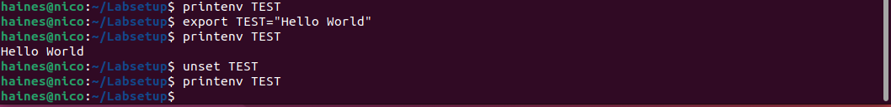
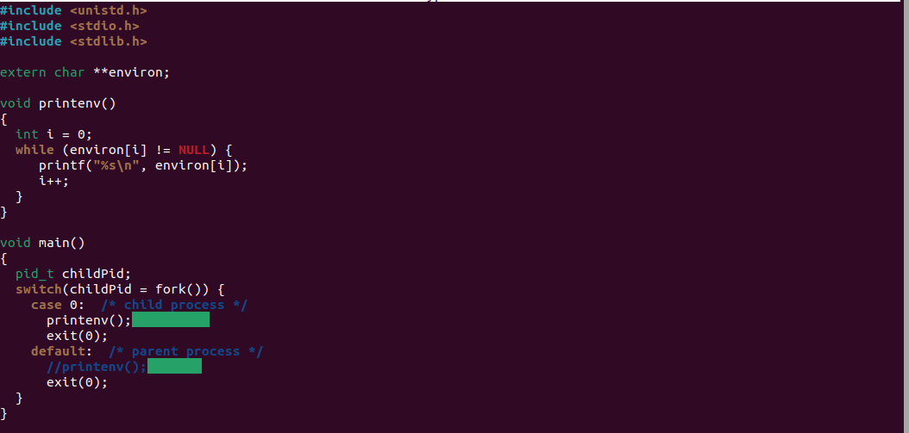
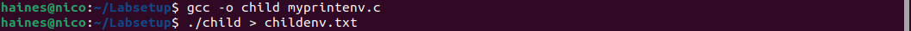
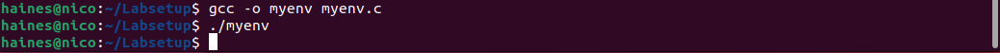
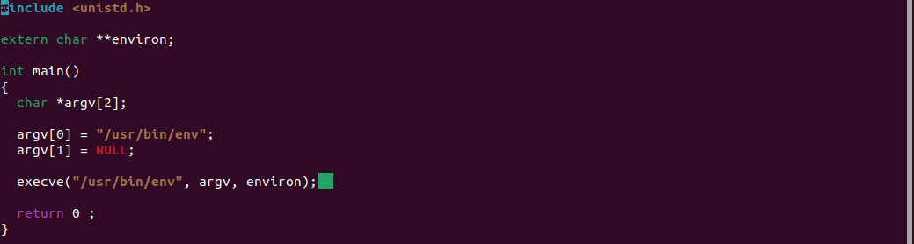
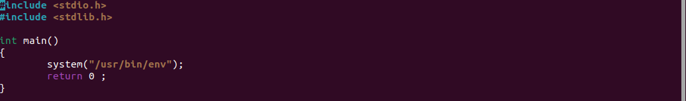
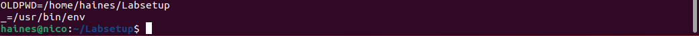

## <h1>**Environment Variables**</h2>

[Click here to return to the Home Repository](README.md)

## **Task 1: Manipulating Environment Variables**

Demonstrates the usage of the printenv and env commands, and how to set and unset environment variables.

    Exporting and unsetting Environment variables:

## **Task 2: Passing Environment Variables from Parent Process to Child Process**

When using fork() to duplicate a process, the child inherits all of the parent’s environment variables. In the example below I use diff to compare the environment variables of the original process (parent) and the duplicate (child). As you can see, there is no difference because the child inherited all of the parent’s variables.

    Here, the child process printenv() is disabled (as a comment).
    I compiled this program and directed the output into a txt file called "childenv.txt"

    I then disabled the child process and removed the comment for the parent process. 
    I compiled the updated program and directed the output into another txt file called "parentenv.txt"

    Using the command:

        diff parentenv.txt childenv.txt

    the output returns blank, meaning no differences.

## **Task 3: Environment Variables and execve()**

This task shows two examples of process environment variable lists. In the first, the third argument to execve() is NULL. When the third argument of execve() is NULL, the new process has no environment variables. When the third argument is the previously identified environ reference, the program lists all of its related environment variables.

    Program titled "myenv.c", when 3rd argument of execve is NULL:

    Terminal compiling and output (results in no output):

<h2>VS</h2>

    "myenv.c", when the 3rd argument of execve is environ:

    Terminal compiling and output (all process environment variables are listed):

etc...

## **Task 4: Environment Variables and system()**

In this task, you can see the flaw of the system() command over execve, where the environment variables are added to the /bin/sh processes

    Program:

    After compiling and running the command:

...

[Click here to return to the Home Repository](README.md)
