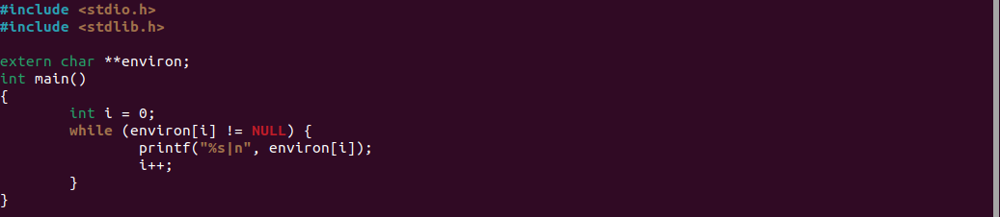
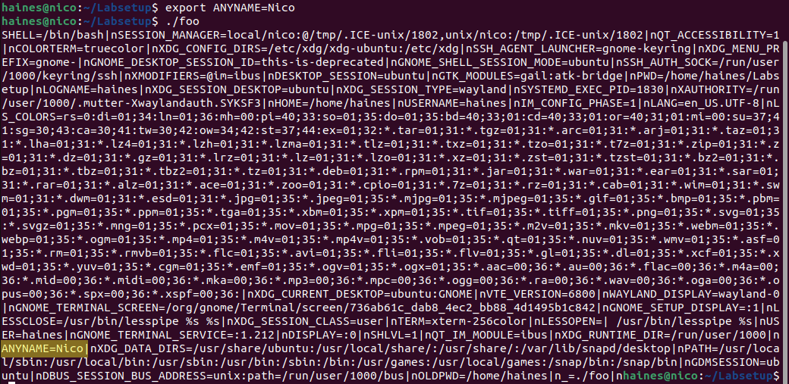
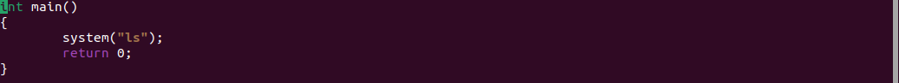
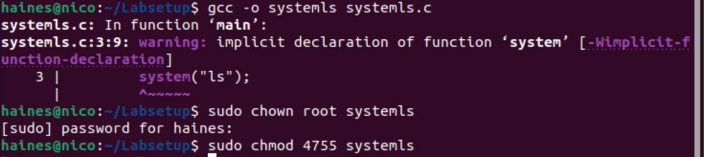
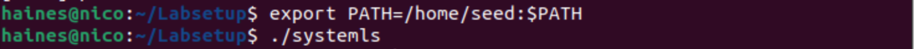

## <h1>**Set-UID**</h1>

[Click here to return to the Home Repository](README.md)

## **Task 5: Environment Variable and Set-UID Programs**

When exporting environment variables as a normal user for a Set-UID program, the new environment variables will be reflected during that session. However, once the session ends and is reopened, those environment variables are no longer present.

    Program "foo.c":

    Compiling, changing the owner to root, and establishing "foo.c" as a Set-UID program:

    Now after setting up this program, when attempting to create a new Environment Variable (for example ANYNAME=Nico), the new ENV is reflected when running the newly compiled ./foo command.

## **Task 6: The PATH Environment Variable and Set-UID Programs**

The following steps demonstrate a vulnerability with the system() method:

    For example, here is a program titled "systemls.c":

    The program is compiled and given Set-UID privileges.

    The PATH Environment Variable is exported to match the relative path of the user:

Given these steps, a user can implement an attack by pointing the PATH environment variable to a malicious directory or file. Because system() invokes the /bin/sh shell and the program is Set-UID, a normal user can cause the Set-UID program to run their malicious code.

[Click here to return to the Home Repository](README.md)
