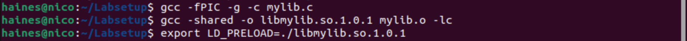
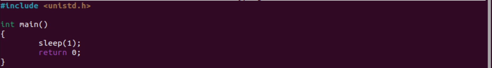
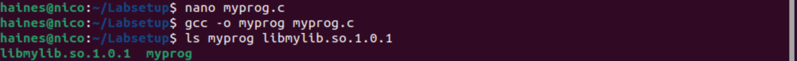
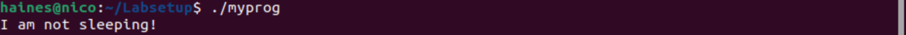
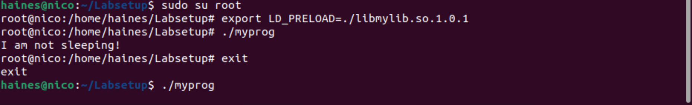
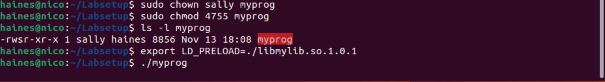

## <h1>**Dynamic Loader/Leaker**</h1>

[Click here to return to the Home Repository](README.md)

## **Task 7: The LD PRELOAD Environment Variable and Set-UID Programs**

This task demonstrates potential vulnerabilities when using shared libraries or dynamic linking. 

    Creating a new file called "mylib.c":

    Compiling the program, adding it to a shared library, and exporting it to the LD_PRELOAD Environment Variable:

    Creating another program called "myprog.c":

    Compiling "myprog.c" and ensuring it is in the same directory as the new shared library (libmylib.so.1.0.1):

These four examples below show how a dynamically linked program can behave under different conditions:
1. Running the program as a **<u>normal user</u>** (program with **<u>regular</u>** permissions) outputs the default/original environment variable value: "I am not sleeping"

2. When the program is owned by **<u>root and is Set-UID</u>**, the linking is successful and a **<u>normal user</u>** is able to run the linked program; this executes sleep().

3. When running as the **<u>root user</u>** while the program is owned by **<u>root and is Set-UID</u>** and **<u>exporting the LD_PRELOAD</u>** environment variable again, the sleep() call is not successful. When running as a **<u>normal user</u>** however, the sleep() call is successful.

4. In this last condition, the **<u>owner is Sally</u>**. As a **<u>normal user</u>** while the program is **<u>Set-UID</u>**, I am still able to run sleep().

Altogether, these outcomes imply that if the program is Set-UID and dynamically linked, a normal user (regardless if they are the owner) may be able to influence or trigger the dynamically linked behavior.

[Click here to return to the Home Repository](README.md)
