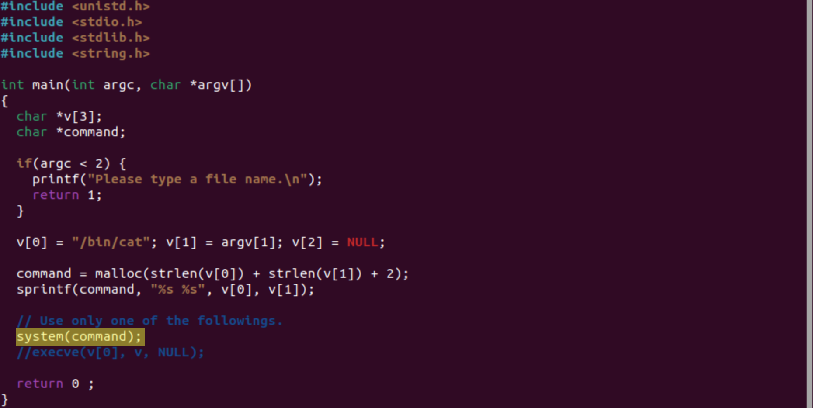
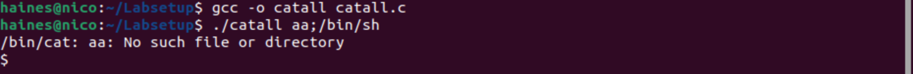
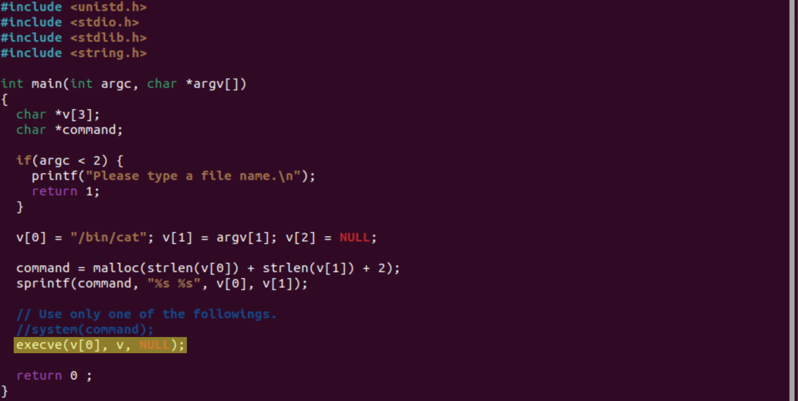
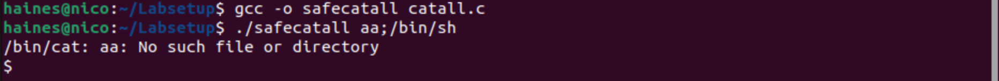

## <h1>**Securely Invoke External Programs**</h1>

[Click here to return to the Home Repository](README.md)

## **Task 8: Invoking External Programs Using system() versus execve()**

This task compares how system() and execve() handle external program execution and why execve() is generally safer.

1. system() hands a string to /bin/sh so it's risky if untrusted users find a way to manipulate or add their own malicious code.

    In theory this can be abused in a Set-UID program, but my attempts did not succeed. This could be due to a feature on Mac OS, possibly with 64-bit restrictions or safeguard.

Here is an example where I am unable to access the root shell by abusing system():

2. When changing to use execve() instead, the vulnerability from system() should not occur because execve() does not invoke the shell in the same way.

   My execve() tests failed to produce a root shell because it explicity uses argv[] and an absolute path.
    

At first, I thought getting a $ prompt meant I had root access, but if I were to have gained access to the root shell, it should actually be shown with #.

[Click here to return to the Home Repository](README.md)
