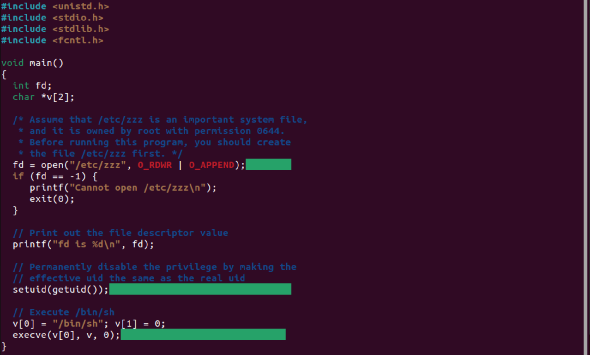
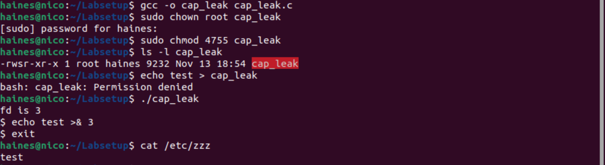

## <h1>**Capability Leaking**</h1>

[Click here to return to the Home Repository](README.md)

## **Task 9: Capability Leaking**

     This program is titled "cap_leak.c"

In this example, capability leaking is caused because a file descriptor is opened but never closed. Because of this, here is what happens:
* The process is Set-UID and opens /etc/zzz.
* There is no guaranteed close of the file descriptor (or guaranteed drop of privileges) before the program executes /bin/sh.
* Because the file descriptor and privileges persist into the shell, a normal user who runs this program can access the root shell and use the open descriptor to reach privileged resources.

**For example:**

In this example, I run the cap_leak command. Because the process is not closed, I have access to the root shell and am able to write to the /etc/zzz directory.

[Click here to return to the Home Repository](README.md)
