**Nicolas Haines**  
**Linux Command Line and Security Basics**

## **(1, 2 & 3\) Updating, Upgrading, and Rebooting the System**

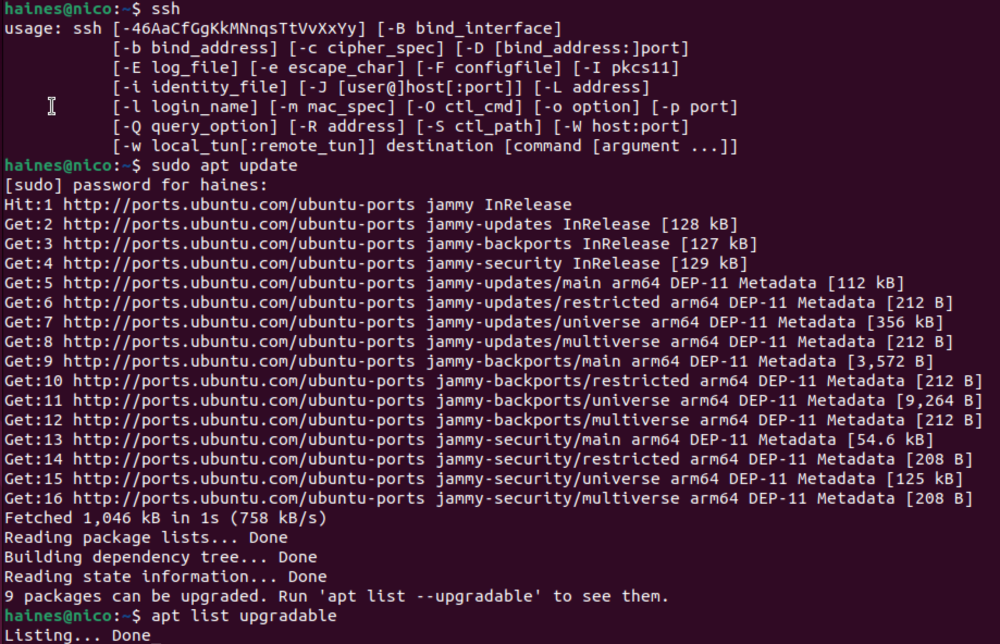
…  
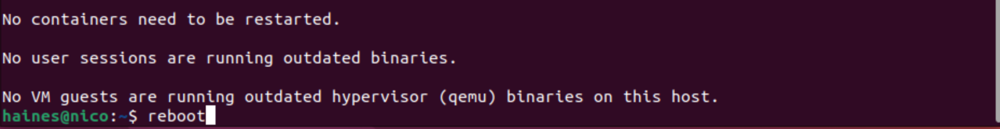

# ---

# **User Tasks**

## **(4) Changing the current user to root**

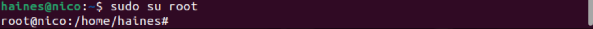

## **(5) What is the difference between the command useradd (e.g. “bobby”) and adduser (e.g. “sally”)?**

**useradd**:  

These steps, including setting password and values, are unique to **adduser:**  
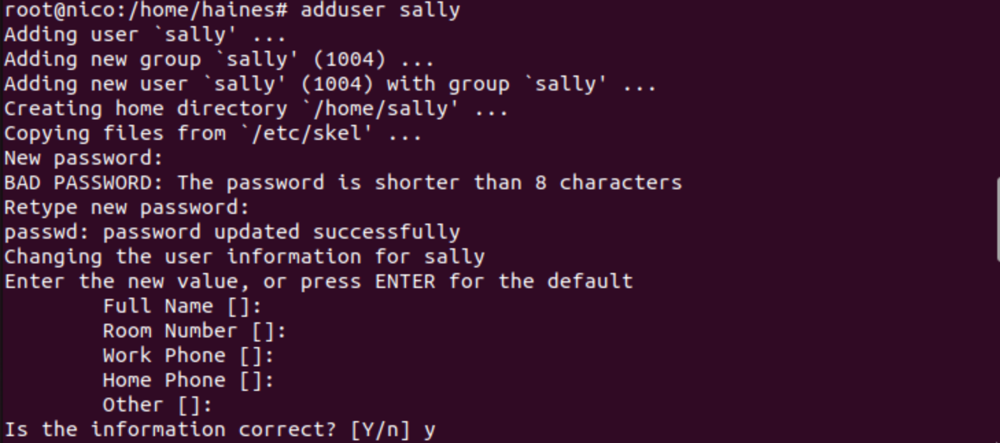

By using  sudo cat /etc/passwd  or  sudo less /etc/passwd , the 2 new users will display as follows:  

## **(6) Changing/logging into another user (e.g. to “sally”)**

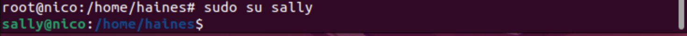

## **(7) When attempting to create a new user (e.g. “earl”) as another user (e.g. “sally”)**

Sally does not have sufficient permission or sudo access to add a new user. Attempting to do so will result in these outcomes:  
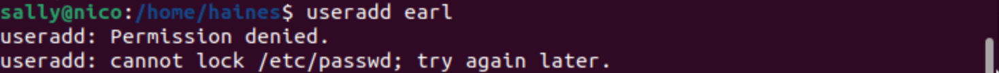

## **(8) Returning to the original user and deleting a user (e.g. “earl”) (when/if it exists)**

## **(9) Changing a user’s password (e.g. “sally”)**

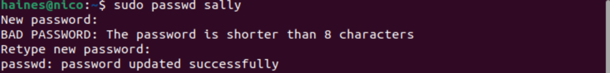

## **(10 and 11\) Returning to the ubuntu (original) user and displaying their user ID** 

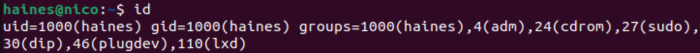

# ---

# **Group Tasks**

## **(12) What groups does the current user belong to?**

1000(haines), 4(adm), 24(cdrom), 27(sudo), 30(dip), 46(plugdev), 110(lxd)

## **(13) Granting user (e.g. “sally”) sudo perms, who can now add new users**

## **(14, 15 & 16\) Creating a new group, adding a user (e.g. “sally”) to it, and checking what other groups the user is in**

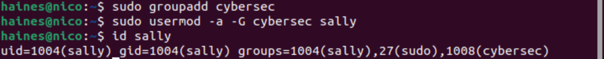 
---

# **Permission and Access Control Lists**

## **(17) Make a new directory and find it’s permissions**

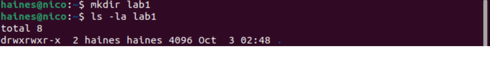

- the owner (haines) has permissions to read, write and execute  
- the group owner (haines) has permissions to read, write, and execute as well  
- other users have permissions to read and execute

## **(18) Creating a new executable bash file that prints “Hello World”**

This is the creation and initialization of the command in the terminal:  

This is what the text inside the bash file looks like:  
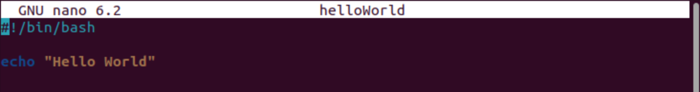

## **(19) Change the group permissions of the helloWorld bash file to also be able to write and execute**

## **(20 & 21\) getfacl and setfacl (e.g. “sally”) to update/add permissions** 

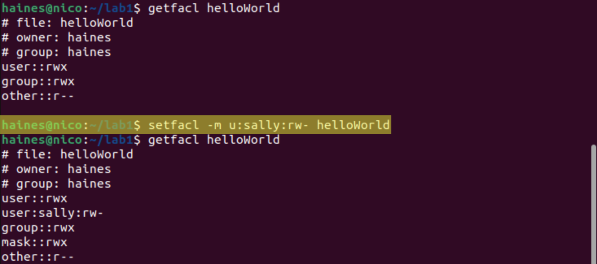